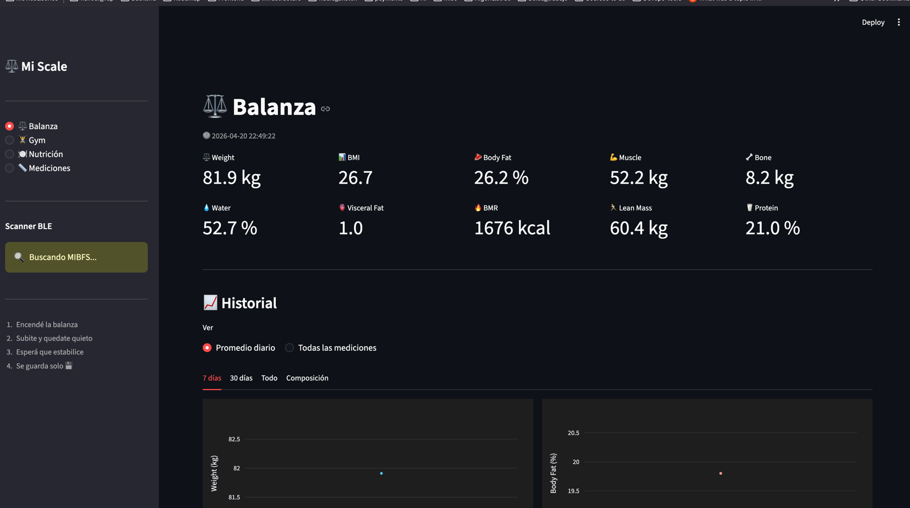
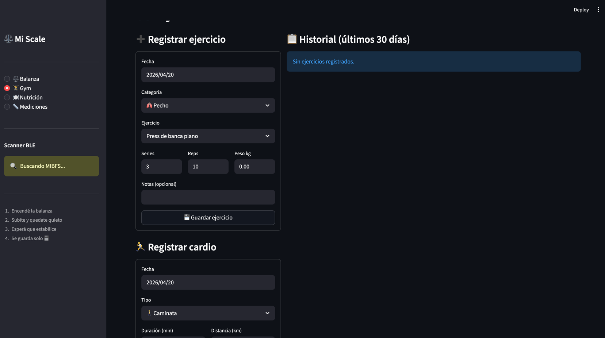
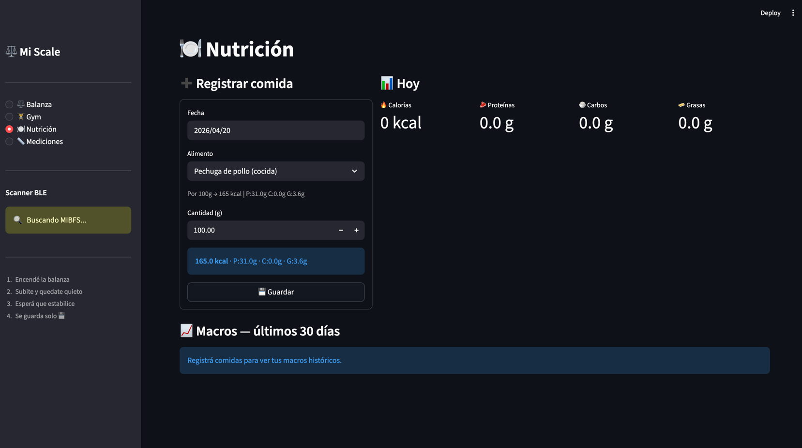
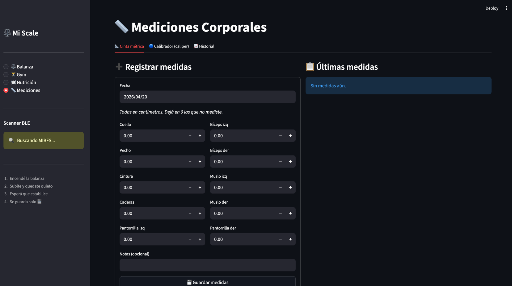

# mi-scale-automation

**mi-scale-automation** es un dashboard personal de salud y fitness que:

- 📡 Lee datos de la balanza **Xiaomi Mi Scale 2** vía Bluetooth (sin cloud de Xiaomi)
- ⚖️ Calcula composición corporal (grasa, músculo, agua, BMI, BMR...)
- 🏋️ Registra entrenamientos y cardio
- 🍽️ Trackea nutrición y macros
- 📏 Mediciones corporales con cinta métrica y calibrador (Jackson-Pollock)
- 📊 Gráficos históricos diarios/semanales/mensuales
- 💾 Todo guardado localmente en SQLite

## Screenshots

| ⚖️ Balanza | 🏋️ Gym |
|:---:|:---:|
|  |  |

| 🍽️ Nutrición | 📏 Mediciones |
|:---:|:---:|
|  |  |

## Créditos

Este proyecto está basado en el trabajo de:
- [barkayshahar/mi-scale-automation](https://github.com/barkayshahar/mi-scale-automation) — script original de lectura BLE
- [wiecosystem/Bluetooth](https://github.com/wiecosystem/Bluetooth) — reverse engineering del protocolo Mi Scale
- [lolouk44/xiaomi_mi_scale](https://github.com/lolouk44/xiaomi_mi_scale) — fórmulas de composición corporal

## Requisitos

- Python 3.10+
- macOS / Linux con Bluetooth Low Energy (BLE)
- Xiaomi Mi Scale 2

## Instalación

```bash
git clone <repo>
cd mi-scale-automation

python3 -m venv .venv
source .venv/bin/activate

pip install -r requirements.txt
```

## Configuración

Editá `user_config.py` con tus datos personales (necesario para los cálculos de composición corporal):

```python
HEIGHT_CM: int = 175   # altura en cm
AGE: int = 30          # edad
SEX: str = "male"      # "male" o "female"
```

## Uso

```bash
streamlit run gui.py
```

Esto abre el dashboard en `http://localhost:8501` **y** arranca automáticamente el scanner BLE en segundo plano.

### Secciones del dashboard

| Sección | Descripción |
|---------|-------------|
| ⚖️ Balanza | Última medición + historial de peso y composición corporal |
| 🏋️ Gym | Registro de ejercicios, cardio y progresión |
| 🍽️ Nutrición | Log de comidas con macros y calorías |
| 📏 Mediciones | Cinta métrica + calibrador de grasa (Jackson-Pollock 3 y 7) |

### Solo el scanner (sin GUI)

```bash
python3 scan.py
```

## Docker

```bash
docker build -t mi-scale .
docker run -p 8501:8501 --network host mi-scale
```

> **Nota:** El acceso a Bluetooth desde Docker requiere `--network host` en Linux.  
> En macOS, Bluetooth dentro de Docker no está soportado — usá el modo normal.

## Google Sheets (opcional)

Para sincronizar mediciones a Google Sheets:

1. Creá un proyecto en [console.cloud.google.com](https://console.cloud.google.com)
2. Habilitá **Google Sheets API** y **Google Drive API**
3. Creá una cuenta de servicio y descargá el JSON como `service_account.json`
4. Creá una hoja llamada `Mi Scale Log` y compartila con el email de la cuenta de servicio
5. El script la populará automáticamente en cada medición

## Troubleshooting

- **No encuentra la balanza**: verificá que tenga baterías y esté cerca. El nombre BLE debe ser `MIBFS`.
- **Impedancia 0 / no calcula grasa**: colocá ambos pies descalzos sobre los electrodos.
- **Bluetooth bloqueado en Linux**: `rfkill unblock bluetooth`
